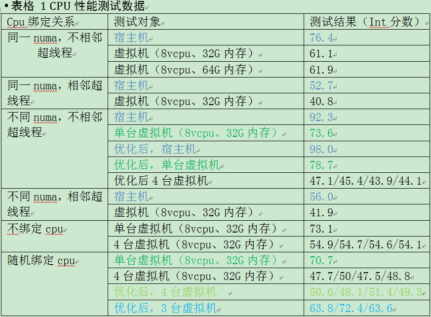
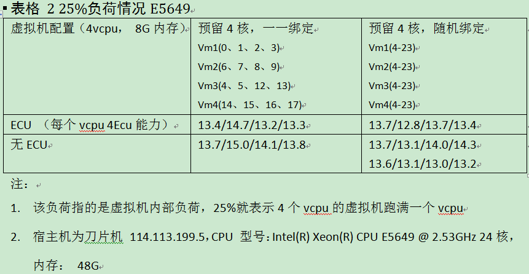
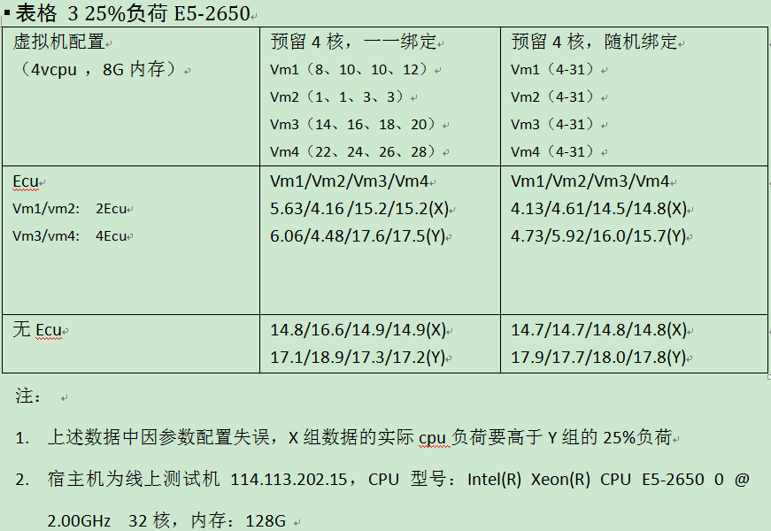
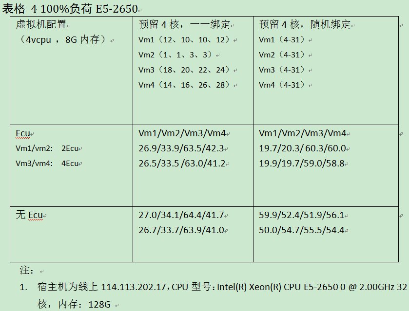
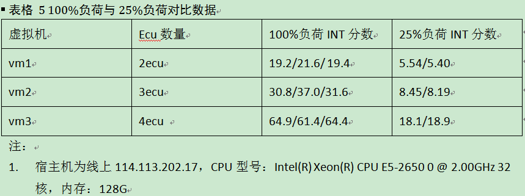
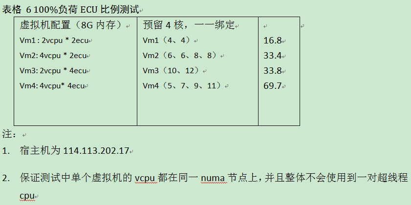

CPU性能测试结论
===============

未开启QoS，仅测试绑定情况
-------------------------

.. note::
    表格中数据均为SPEC CPU 2006测试得出的INT值

* 关闭虚拟机的tickless mode，开启宿主机和虚拟机的THP大页模式，虚拟机性能可提升6%左右

* 对物理机本身而言，测试任务在不同cpu组合上运行的性能存在一定差异，4个任务跑在2个不同numa的不相邻超线程cpu上的性能最优（92.3）；在同一numa，2对相邻超线程cpu上的性能最差（52.7）

* 单台虚拟机，通过绑定cpu，与物理机在相同cpu上运行，性能较之于物理机会下降20%左右

* 不给宿主机预留cpu，4台虚拟机分配完宿主机的所有cpu进行测试，虚拟机本身的性能较之于只运行单台虚拟机的性能会下降28%左右

* 上述结论根据表格1中数据得出

开启QoS，测试ECU的效果以及不同绑定关系的性能对比
------------------------------------------------

* 虚拟机25%负荷情况下，一一绑定与随机绑定的性能值相差不大，一一绑定略偏好

* 虚拟机25%负荷情况下，设定Ecu后，Ecu多的虚拟机性能好，但性能值与Ecu个数不成正比。4Ecu的性能比2Ecu的高两倍

* 上述结论根据表格2、3中数据得出

|

* 虚拟机100%负荷下（宿主机整体负荷为48/112），一一绑定和随机绑定的虚拟机性能值总和差不多。但一一绑定的时候，存在相同Ecu配置的虚拟机由于绑定关系的原因而性能不一致

* 虚拟机100%负荷下，设定Ecu后，Ecu多的虚拟机性能好，但性能值与Ecu个数不成正比（原因下面有分析）

* 上述结论根据表格4中数据得出

* 随机绑定，不论何种负荷下，随机绑定中，性能值与Ecu间的不成比例现象都存在，问题与负荷无关

* 上述结论根据表格5中数据得出

* 性能值与Ecu个数不成正比的原因为宿主机numa结构及超线程对性能的影响

* 上述结论根据表格6中数据得出

综合结论
--------

综合上述测试的结果，可以得到如下推论：

* CPU性能值受宿主机NUMA结构、超线程影响较大。当宿主机上分配的Ecu比例超过25%出现单个虚拟机内部CPU跨NUMA或者使用到超线程的情况下，虚拟机的性能不可避免地会受到影响

* 不论何种绑定关系，若使用到了超线程，受超线程影响，都会出现虚拟机CPU性能与Ecu数量不成正比的现象。一一绑定VCPU，同一Ecu配置的虚拟机也会存在cpu性能不一致的现象。而随机绑定vcpu，同一Ecu配置的虚拟机的cpu性能值比较一致

* 虚拟机内部低负荷情况下，一一绑定的CPU性能略优于随机绑定。虚拟机内部高负荷下，随机绑定的性能值偏好
